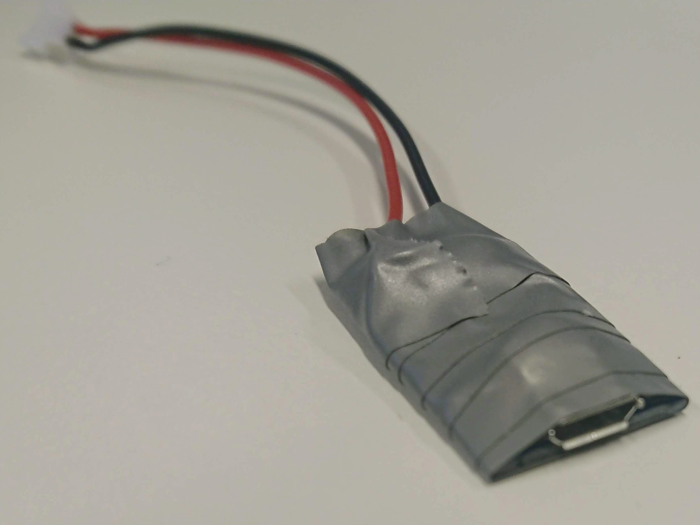
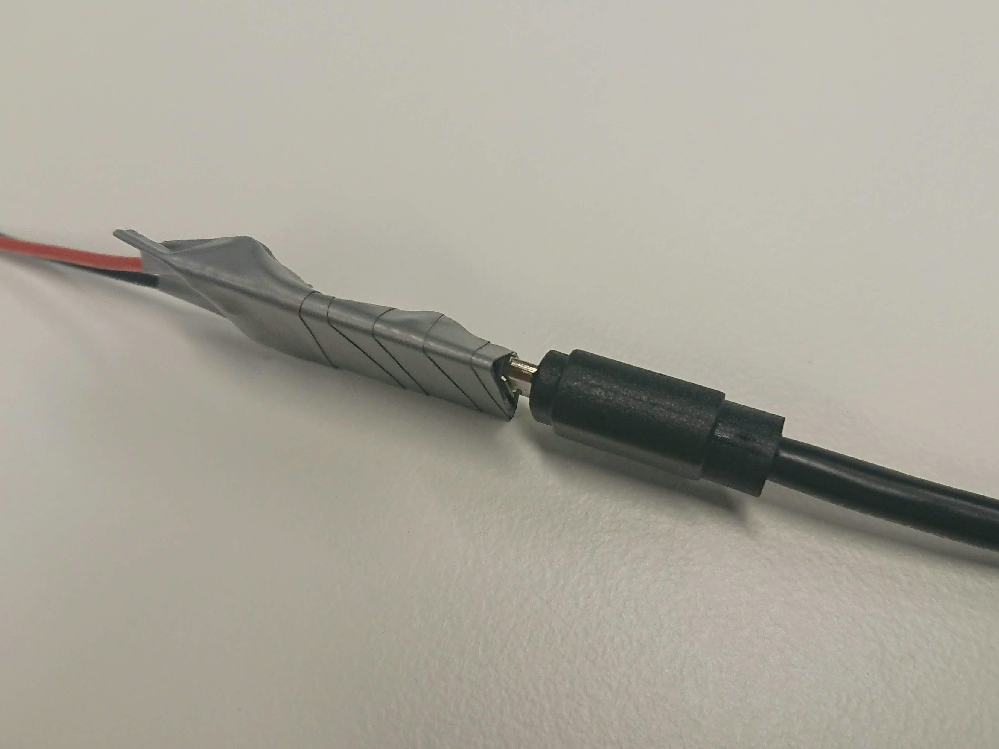
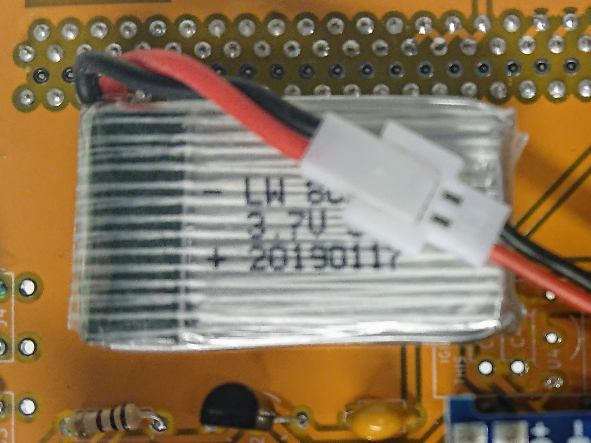
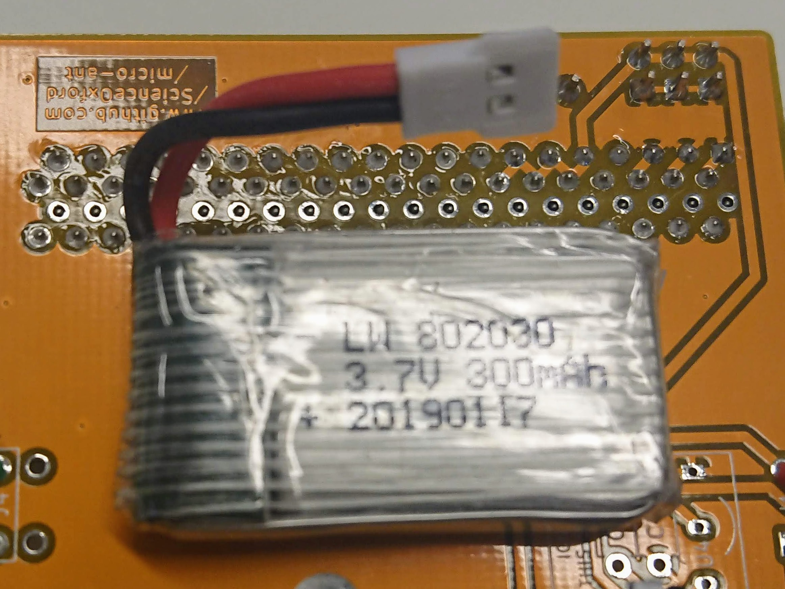
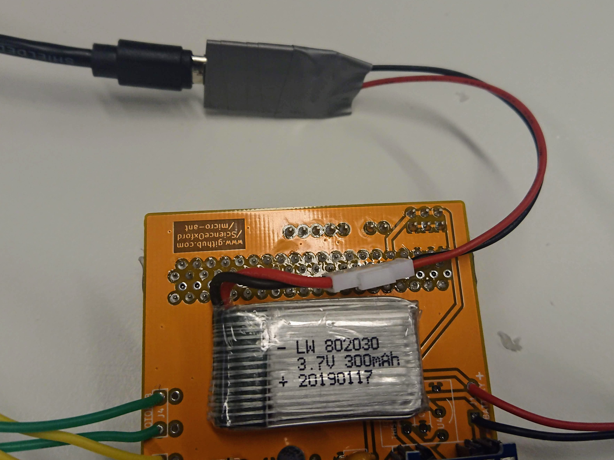
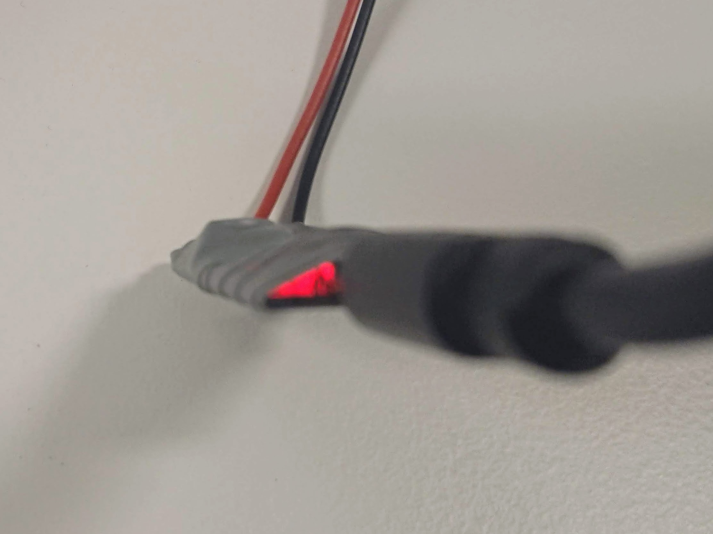
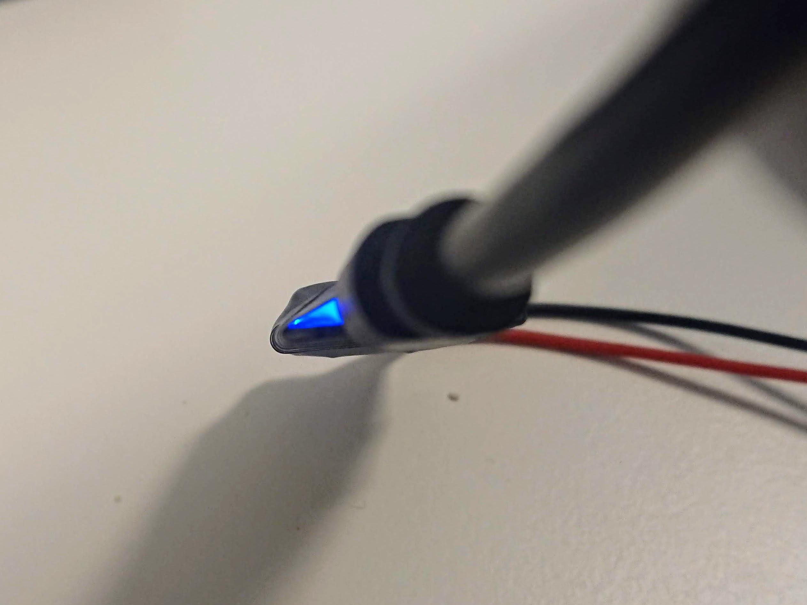

# micro:bit antweight information

If your charging port has broken, and we have sent you a new one, please follow these instructions!

### Step 1
Gently connect a microUSB lead to the socket in your new charger - do not plug it into a power source yet.

### Step 2
Open up your robot to expose the battery, then unplug it.

### Step 3

Connect your new charger to your robot's battery.

### Step 4

Plug the USB cable into a power source.
While charging, you should see a red light, which turns blue when the battery is fully charged.

### Step 5

Unplug the charger, and plug the battery back into the cable on the robot.
